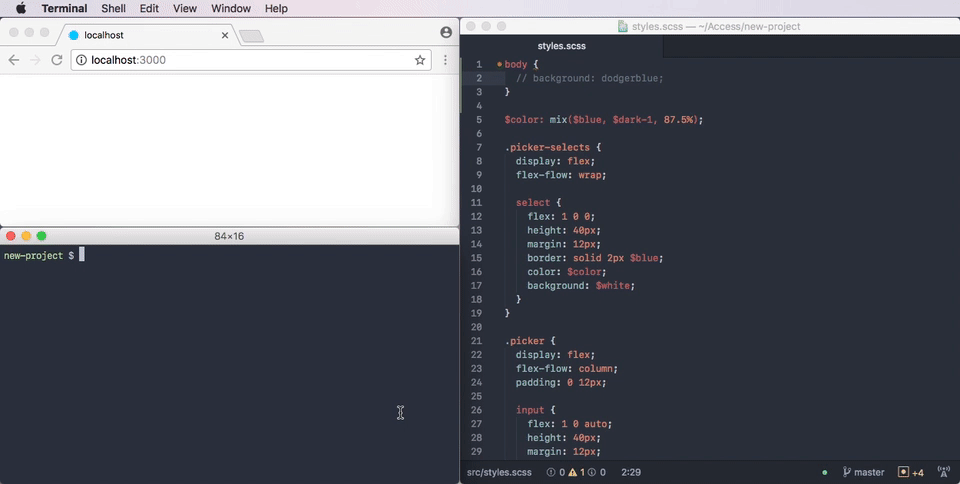

# dev-server

Watch files, execute build scripts, and launch an auto-reloading dev server.



## Install

```sh
$ npm i @jamen/dev-server
```

## Usage

### `dev-server <entry> --watch <glob> <command>`

Starts a server at `entry` and creates the given watchers.

```sh
$ dev-server dist --watch "src/**/*.js" "make js"
$ dev-server dist --watch "src/**/*.js" "cat $FILE"
```

Or with multiple watchers:

```sh
$ dev-server dist --watch "src/**/*.js" "make js" \
                  --watch "src/**/*.css" "make css" \
                  --watch "src/**/*.html" "make html"
```

Use `$FILE` inside the command string if you need access to the path.

The server can be configured through the environment variables:

- `DEV_SERVER_ADDRESS`
- `DEV_SERVER_PORT`
